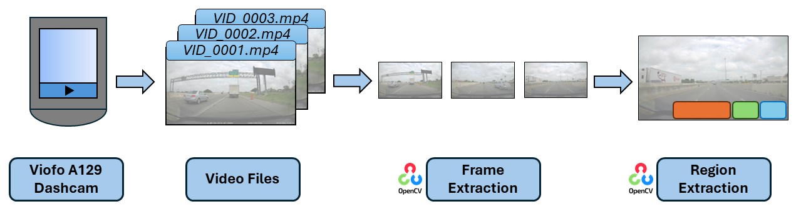
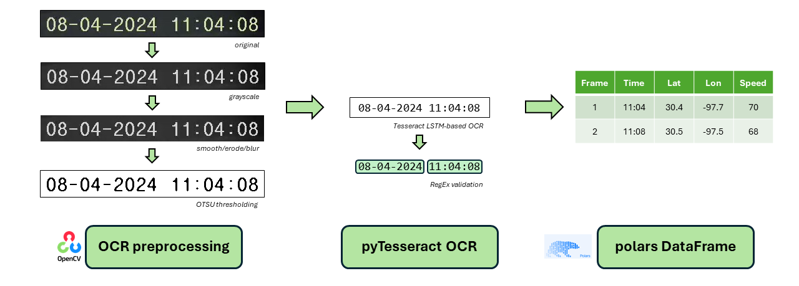
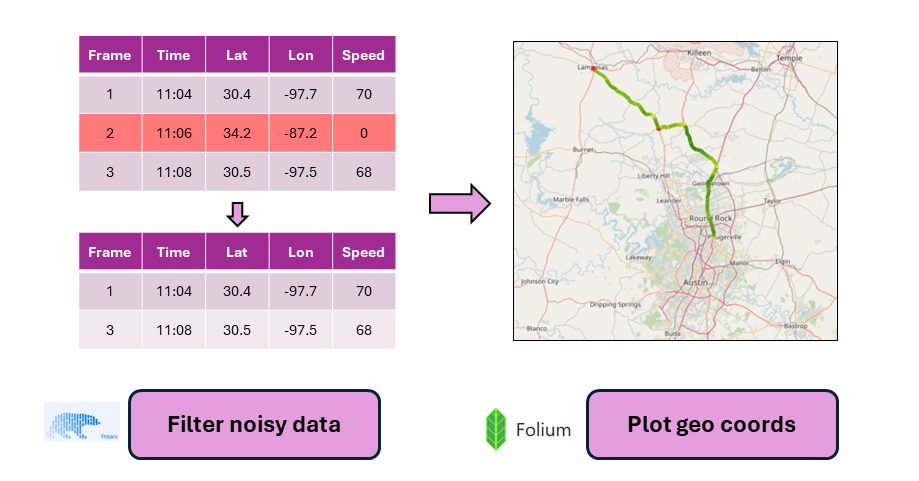
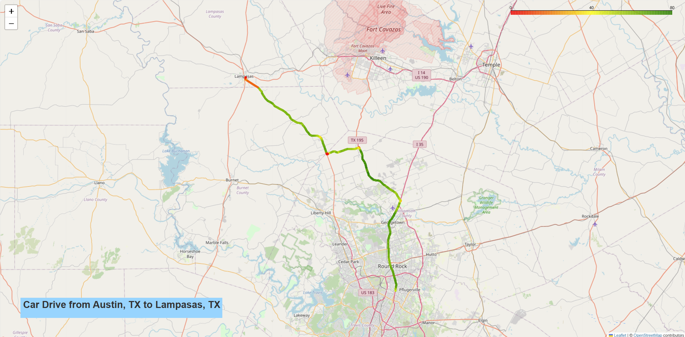

# OCR Data Pipeline for Dashcam Videos

### Introduction

For many drivers, dashcams are an indispensable car accessory. Dashcams are typically mounted to the front or rear windshield of a car and capture video footage of each vehicle trip. Typically, dashcam software will embed sensor data into the output videos, including GPS coordinates, speed, and timestamps. However, if one seeks to access this data, it is only accessible by playing the video file itself. It is not typically saved into a separate directory. This makes data workflows somewhat cumbersome. However, there are several ways this information can be extracted.

### Problem and Solutions

The problem is that the dashcam sensor data is baked into the video file and is not easily extractable.

Solutions:

1. Utilize the `strings` utility on Unix and a bit of `grep` magic to extract the coordinate, speed, and time data points.
2. Play each video and log each datapoint in Excel as you manually step through the frames.
3. Define extraction regions for the locations of each desired sensor datum and run OCR on each snippet.
4. Build a generalizable OCR method that employs automatic scene text detection and then run OCR on each snippet.

### Motivation

Out of the above methods, I decided to implement the third. The location of each piece of information is static and therefore generalizability is not critical. However, it would be worthwhile to implement as a potential future project.

This project excited me because it involved building an ETL pipeline for video streams. I was deeply curious how accurate OCR/computer-vision methods would be for dashcam videos. Dashcam videos can significantly vary visually from second-to-second, especially as the sun's shadow changes on sunny days, or as a car turns and the background of each text stamp changes from green grass to noisy asphalt to blue sky. Finally, I wanted to graph the car's path and visually inspect for any traffic bottlenecks.

### Inputs and Outputs

##### Inputs

The input is a video of a 1 hr 9 min drive from Austin, TX to Lampasas, TX, broken up into 23 segments of 3-min each. The video was taken on April 8th, 2024, shortly before the total solar eclipse which occurred directly over Lampasas.  

##### Outputs

One output is an interactive map of the car's path and color-coded speed. A second output is the exported dataframe in CSV format.

### ETL Diagrams

##### Video Operations (Extract)

##### OCR Operations (Transform & Load)

##### Map Operations

### Final Map Output

Please see the screenshot below of the interactive map found under the `output` directory.

### Skills and technologies used

* OpenCV
  * Frame extraction
  * Region-of-Interest (ROI) extraction
  * OCR preprocessing:
    * Otsu's thresholding method
    * MedianBlur
    * Smooth/erode
* RegEx
* pyTesseract OCR
  * Image-to-text detection
* Polars DataFrames
  * Dataframe filtering and joining
* Folium geo-coordinate mapping